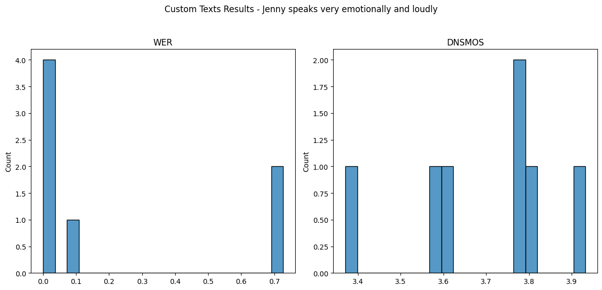
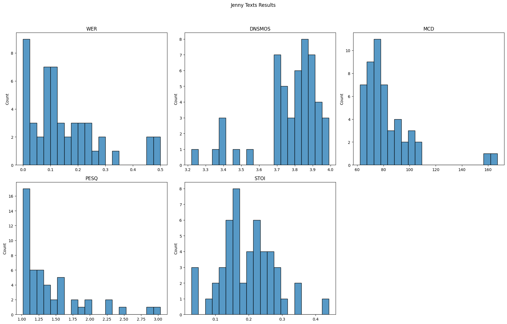
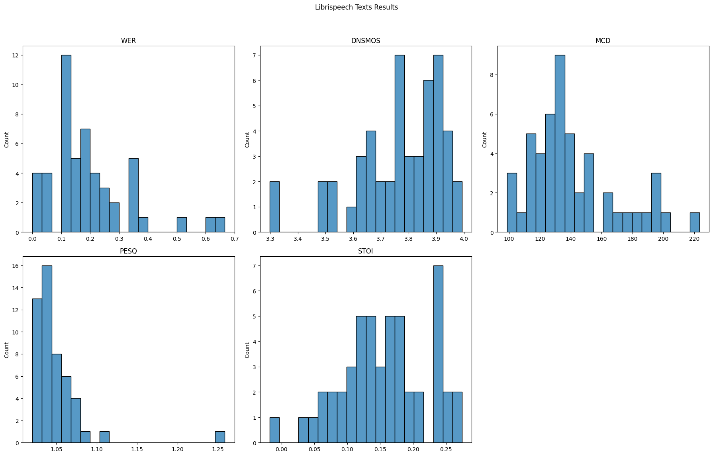

# parler-tts-mini-jenny-30h_evaluation
Оценка качества синтеза модели https://huggingface.co/parler-tts/parler-tts-mini-jenny-30H, которая была дообучена на датасете Jenny. 

Горбунцов Александр

aagorbuntsov@edu.hse.ru

@goralex022

+79167127207

Лучше запускать из Google Colab, весь код выполняется на бесплатной версии T4 примерно 50 минут.

https://colab.research.google.com/drive/1Dslguw2_xUFCBtxVSi5_o7kvyfPpOpHE?usp=sharing

--- 

## Суть решения
Были взяты следующие источники для оценки качества:
* LibriSpeech:
Использовали набор данных LibriSpeech с разделом test-clean, взяли 50 случайных аудиозаписей с текстами из тестовой части. Привели тексты к нижнему регистру для обеспечения корректного распознавания.
* Jenny:
Использовали исходный набор данных Jenny, также выделили небольшую тестовую выборку из 50 случайных аудио.
* Custom Texts:
Создали несколько своих текстов. Использовали разные описания для каждого текста, чтобы оценить влияние описания на качество синтеза, сами тексты отличаются по смыслу и эмоциональной нагрузке.

Планируется оценить:
* Точность произношения: Проверка правильности произношения слов и фраз.
* Грамматическая корректность: Проверка правильности ударения, связности фраз.
* Эмоциональная окраска: Способность модели передавать эмоциональный тон текста.
* Плавность и естественность: Непрерывность и естественность произнесенного текста.
* Соответствие исходному аудио: Степень близости синтезированного аудио к оригинальному.

Для этого были выбраны следующие метрики:
* WER (Word Error Rate): Оценивает точность распознавания сгенерированного аудио. Диапазон значений: 0.0 (0%) — 1.0 (100%), чем ниже , тем лучше. 0.0 (0%), что означает полное соответствие между распознанным и эталонным текстом.
* DNSMOS (Deep Noise Suppression Mean Opinion Score): Оценивает качество звука и отсутствие шума. От 1.0 до 5.0, где 1.0 — очень низкое качество, а 5.0 — очень высокое качество.
* MCD (Mel-Cepstral Distortion): Измеряет расстояние между мел-цефтроструктурами эталонного и сгенерированного аудио. Обычно от 0 до 20 dB, где 0 — идеальное совпадение, а выше 20 dB указывает на значительные различия
* PESQ (Perceptual Evaluation of Speech Quality): Оценивает восприимчивое качество звука. От -0.5 до 4.5, где -0.5 — очень низкое качество, а 4.5 — очень высокое качество.
* STOI (Short-Time Objective Intelligibility): Оценивает интеллектуальную понятность синтезированного аудио. От 0 до 1, где 0 — очень низкая интеллектуальная понятность, а 1 — идеальная интеллектуальная понятность.

---

## Общий план решения:
1. Подготовка нужных библиотек и самой модели
2. Ручной анализ крайних случаев
3. Подготовка данных из вышеназванных источников
4. Проведение расчета метрик
5. Визуализация результатов
6. Итоги и вывод

---

## Итоги и вывод

| Источник текста \ метрика   | WER      | DNSMOS   | MCD      | PESQ     | STOI     |
|-----------------------------|----------|----------|----------|----------|----------|
| **Custom Texts**            | 0.2456   | 3.7410   | нет      | нет      | нет      |
| **Jenny**                   | 0.1458   | 3.7609   | 82.3628  | 1.4224   | 0.1939   |
| **LibriSpeech**             | 0.1910   | 3.7652   | 141.6121 | 1.0486   | 0.1562   |

Подробные результаты для каждого выбранного текста в соответсвующих файлах в папке results_csv.

- Модель очень хорошо озвучивает тексты, при грамотном подборе описания результаты впечатляют. Основные трудности включают подбор этих описаний, невозможность работы с цифрами и аббревиатурами, также модель вводит в ступор другой язык с латинским алфавитом. Но в среднем модель очень хороша.

- Датасет Jenny ожидаемо показал лучший результат метрики WER, на Librispeech эта метрика хуже, но на вполне нормальном уровне. На кастомных текстах очевидно прослеживается связь между описанием и качеством метрики WER, чем быстрее и эмоциональнее, тем лучше. Не до конца понятно почему так, это может быть связано как с особенностями модели Whisper, так и с особенностями тренировочного датасета Jenny, либо я подобрал такие тексты. На эту тему нужны дальнейшие исследования. Но в целом метрика на хорошем уровне.

- DNSMOS и PESQ везде очень хороши, модель генерирует хорошую речь.

- MCD и STOI показывают отвратительный результат, при том что метрики собственно качества речи очень хороши. Это может быть связано с разницей в тембре, скорости произношения и эмоциональной окраске текстов. По идее каждому тексту надо подбирать свое описание, ведь странно произносить диалог из книги и описание цветка одним стилем. Оригинальный датасет Jenny содержит разнообразные стили озвучивания, включая новые заголовки газет, транскрипты видео, книги и другие материалы. Описание должно отражать этот разнообразие.
